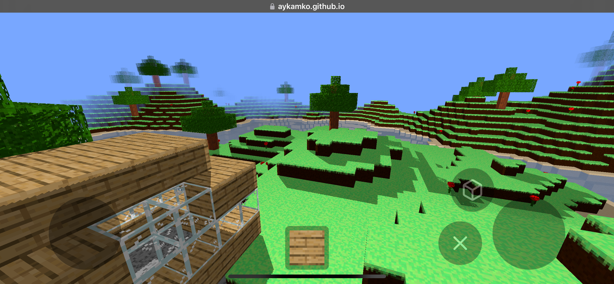

# Minecrust ⛏️

A Minecraft clone that runs in the browser, written from scratch in Rust.

Works on desktop and mobile.

Try it out: https://aykamko.github.io/minecrust

## Why?

This project is primarily for learning and proving to myself that I can write a game engine from scratch. Furthermore, I wanted to learn Rust, make the game easily accessible in the browser, and make it presentable like a real product.

As for my motivation, I've always had a deep respect for game developers. I used to believe that games and graphics were a dark art accessible only to a select few. But then I learned a bit about graphics from my work at [Mighty](https://www.youtube.com/watch?v=cxUN1dZ0Edk), and I got inspired by jdh on Youtube who [wrote his own Minecraft clone](https://www.youtube.com/watch?v=4O0_-1NaWnY). I started to think, "Whoa, this isn't a dark art. I can do this too!"

## Cool Features

- Infinite, procedurally generated terrain. Dynamic memory management to achieve infinite world
- Physics simulation and collision detection for the playable character
- Custom shaders for shadows, diffuse reflection, and specular reflection
- It's fast. Runs at >30 FPS on most phones and laptops
- A single Rust codebase that runs on all platforms: Web and Native (MacOS, Windows, Linux). Huge thanks to [wgpu](https://github.com/gfx-rs/wgpu) and [wasm-pack](https://github.com/rustwasm/wasm-pack) for enabling this
- ~~Beautiful~~ Custom artwork by yours truly
- You can build a house in it 🏠

## Notable Tech

## Things to improve that I will realistically never do

- Increase draw distance on mobile
  - Probably need to implement view-frustum culling for this to be feasible
- Ability to save the world and load it up later
- Better shadows
  - Antialiasing
  - Draw at a further distance
- More block types
- Better terrain generation
- Ability to choose a different seed so terrain is generated differently
- Better art? lol